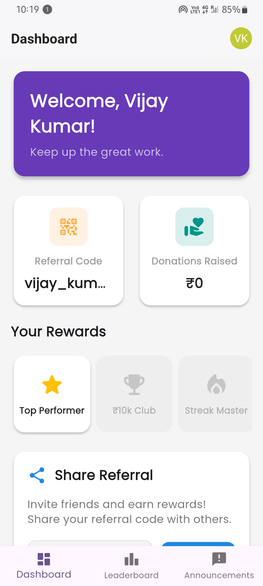
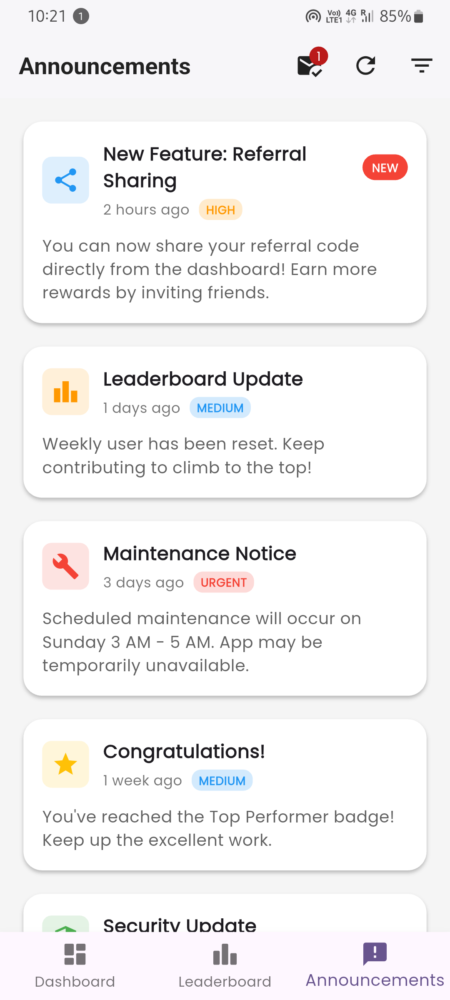

# She Can

A Flutter application showcasing modern UI design and state management with BLoC pattern.

## Features

- User Authentication (Login/Signup)
- Dashboard with user statistics
- Leaderboard functionality
- Announcements system
- User profile management
- Theme mode selection (Light/Dark)
- Referral sharing with QR codes

## Dummy Data

This application uses dummy data for demonstration purposes:

### User Data

- **Username**: demo_user
- **Email**: demo@example.com
- **Score**: 1250 points
- **Rank**: #5 in leaderboard

### Dashboard Statistics

- Total points earned: 1250
- Current streak: 7 days
- Completed challenges: 23
- Friends referred: 5

### Leaderboard

- Sample users with varying scores (500-2000 points)
- Ranking system based on points
- User avatars and achievement badges

### Announcements

- Welcome announcement for new users
- Weekly challenge notifications
- System updates and maintenance notices
- Achievement unlock notifications

## Screenshots

### Authentication Screens


*Login screen with email and password fields*


*User registration with form validation*


*Success confirmation after login*


*Registration completion confirmation*

### Main Application Screens



*Main dashboard showing user stats and progress*


*Competitive leaderboard with user rankings*



*System announcements and notifications*


*User profile with personal information and settings*

### Additional Features


*Light and dark theme toggle functionality*


*QR code generation for referral sharing*

## Getting Started

### Prerequisites

- Flutter SDK (3.0.0 or higher)
- Dart SDK (2.17.0 or higher)
- Android Studio / VS Code
- Android device or emulator

### Installation

1. Clone the repository:

```bash
git clone <repository-url>
cd shecan
```

2. Install dependencies:

```bash
flutter pub get
```

3. Run the application:

```bash
flutter run
```

## Project Structure

```
lib/
├── main.dart
├── core/
│   ├── di/              # Dependency injection
│   ├── router/          # App routing
│   ├── services/        # Core services
│   ├── state/           # Global state management
│   └── theme/           # App theming
└── features/
    └── shecan/          # Main feature module
```

## State Management

This project uses the BLoC pattern for state management:

- **Cubit**: For simple state management
- **Bloc**: For complex business logic
- **Equatable**: For state comparison

## Dependencies

- `flutter_bloc`: State management
- `equatable`: Value equality
- `get_it`: Dependency injection
- Additional UI and utility packages

## Contributing

1. Fork the repository
2. Create a feature branch
3. Commit your changes
4. Push to the branch
5. Create a Pull Request

## License

This project is licensed under the MIT License - see the LICENSE file for details.
